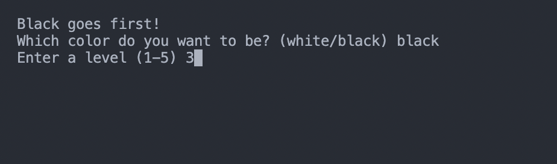
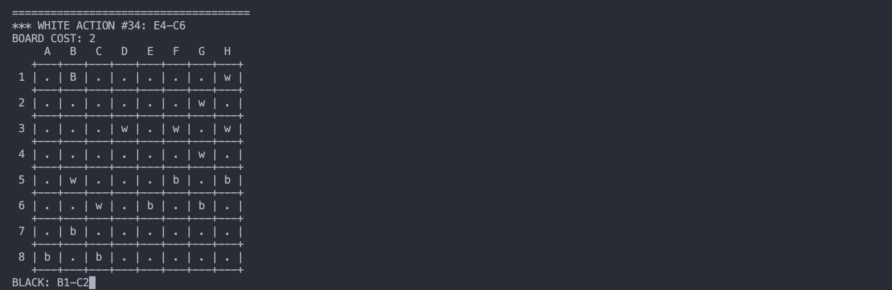

# Checkers game

A classic checkers game played on the command line, built using C.

## Project Screenshots

## Installation and Setup Instructions
Clone this repository. You will need a C compiler such as [gcc](https://gcc.gnu.org/install/) or [clang](https://clang.llvm.org/get_started.html) to run the program.

Installation / Compilation:

`make`

To run the program:

`./main`

## How to play the game

Once you start the game, you will be prompted to choose a color, type `black`/`b` or `white`/`w` to choose your color. Black starts first!

Next, you will have to choose a level between 1 and 5 for your game. Now, you can start playing your game!

To make a move, you have to input `<source_cell>-<target_cell>`. This input is **case-sensitive** and in all **upper case**, and the game will stop immediately if you make an invalid input or an imvalid move.

### Game-rules
1. Each player plays all pieces of the same color. Black open the game by making a move, then white make a move, and then players alternate their turns. In a single turn, the player either makes a move or capture.
2. A piece may *move* to an empty cell diagonally forward (toward the opponent; north for black and south for white) one square.
3. When a piece reaches the furthest row (the top row for black and the bottom row for white), it becomes a *tower* (a pile of pieces). A tower may move to an empty cell diagonally, both forward and backward, one square.
4. To *capture* a piece or a tower of the opponent, a piece or a tower of the player jumps over it and lands in a straight diagonal line on the other side. This landing cell must be empty. When a piece or tower is captured, it is removed from the board. Only one piece or tower may be captured in a single jump, and, in this variant of the game, only one jump is allowed in a single turn. 
5. A player wins the game if it is the opponent’s turn and they cannot take action, move or capture, either because no their pieces and towers are left on the board or because no legal move or capture is possible.

## Motivations
This was created as an extension to my UniMelb COMP10002 project to apply the algorithms and data structures I've learnt into a programming project. The main algorithm used for the game bot is the `minimax` algorithm, and it's implemented using a `tree` data structure.
